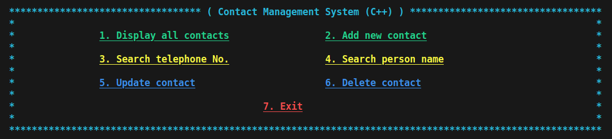

# Contact Management System (C++)

[](LICENSE.md)

> A **Contact Management System** developed in *C++* to help you manage your contacts.

 - [Project Overview](#project-overview)
 - [Settings](#settings)
 - [Credits](#credits)

---

<div id="project-overview"></div>

## Project Overview

 - **Features:**
   - **The project has a CLI with 7 options:**
     - **1. Display all contacts**
       - This feature shows all contacts stored in the [data/contacts.txt](./data/contacts.txt).
       - The contacts are stored in the format: *"contactName,phoneNumber"*
     - **2. Add new contact**
       - This feature adds a new contact to [data/contacts.txt](./data/contacts.txt).
       - The feature receives:
         - The contact name.
         - The contact phone number.
     - **3. Search telephone No.**
       - This feature receives a phone number by the user and search in [data/contacts.txt](./data/contacts.txt).
       - However, this feature removes *special characters* and *white spaces*. For example, if the user pass:
         - `[83]123456789`, `83 123456789`, `(83) 123456789` the final result always will be `"83123456789"`.
     - **4. Search person name**
       - This feature receives a name from the user and searches in [data/contacts.txt](./data/contacts.txt).
       - If the user passes the capital name or uppercase the method converts lowercase before comparing. For example:
         - `Rodrigo Leite`, `rodrigo Leite`, `RODIRGO LEITE` the final result always will be `"rodrigo leite"`.
       - Also, if the user passes a special character it will be removed before the search. For example:
         - `João` to `joao`.
     - **5. Update contact**
       - This feature opens another menu and asks the user if he wishes to modify a contact by *name* or *phone number*:
         - If you wish to modify your contact name enter one (1)
         - If you wish to modify your phone number enter two (2)
         - If you wish to back to the main menu enter three (3)
     - **6. Delete contact**
       - This feature removes a contact from [data/contacts.txt](./data/contacts.txt).
       - This feature also opens another menu and asks the user if he wishes to delete a contact by *name* or *phone number*:
         - If you wish to delete a contact by name enter one (1)
         - If you wish to delete a contact by phone number enter two (2)
         - If you wish to back to the main menu enter three (3)
     - **7. Exit**
       - Finally, this option closes the CLI (program).
 - **Source code:**
   - **contact.(h and cpp):**
     - The *Contact class* provides methods to manage your contacts.
   - **cli.(h and cpp):**
     - The CLI class provides an interface to manage you Contact information.

---

<div id="settings"></div>

## Settings

To use the project you can compiler and run the project manually:

```bash
cd src/
```

```bash
g++ main.cpp cli.cpp contact.cpp -o program.out && ./program.out
```

You can also use the [Makefile](Makefile) (in the root folder):

```bash
make
```

```bash
./bin/contact_management_system 
```

> **NOTE:**  
> To clean the binaries run: `make clean`.



---

<div div="credits"></div>

## Credits

 - This project was developed based on the ["C++ implementation of Phone Book Management System"](https://cppsecrets.com/users/22319897989712197103975756505164103109971051084699111109/C00-implementation-of-Phone-Book-Management-System.php) article.
 - However, I modified the project to use classes and other features.

---

Ro**drigo** **L**eite da **S**ilva - **drigols**
